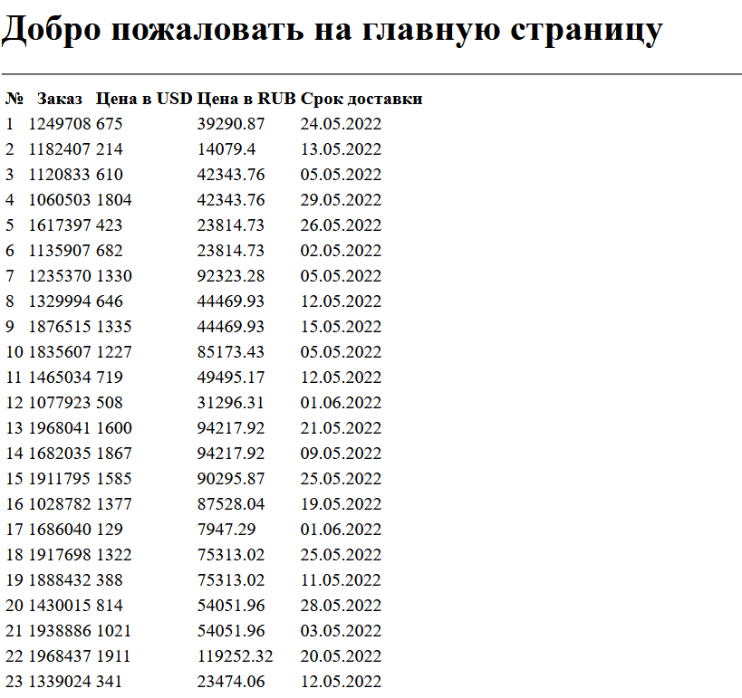

# Приложение TestTask для Numbers

## Как запустить проект:

Клонировать репозиторий и перейти в него в командной строке:
```
git clone https://github.com/Edw125/TestTask.git
cd TestTask
```
Cоздать и активировать виртуальное окружение:
```
python -m venv env
source env/bin/activate
```
Установить зависимости из файла requirements.txt:
```
python -m pip install --upgrade pip
pip install -r requirements.txt
```
Выполнить миграции:
```
python manage.py migrate
```
Создать учетку админа:
```
python manage.py createsuperuser
```
В папке с файлом manage.py выполните команду:
```
python manage.py runsslserver 127.0.0.1:9000
```
Для запуска автообновления базы:
```
celery -A TestTask worker -l INFO
```
Получить учетные данные google и положить их в папку (пример пути):
```
./creds/credentials.json
```
Пройти авторизацию на эндпоинте:
```
127.0.0.1:9000/gsheets/authorize/
```
Результат:
```
https://docs.google.com/spreadsheets/d/1VW-39lkvuQp62b_A2LyNY83sfilpCs0_AdHZR-T4dtQ/
```


## Как развернуть проект в Docker:
Для запуска docker-compose необходимо перейти в папку с загрузками и перейти:
```
cd ./TestTask
```
Выполнить команду для запуска из папки:
```
docker-compose up
```
Остановить проект можно командой:
```
docker-compose stop
```
Пересобрать контейнеры:
```
docker-compose up -d --build 
```
Остановка и полное удаление контейнеров:
```
docker-compose down -v 
```
Выполнить миграции, где контейнер с Django:
```
docker-compose exec <container> python manage.py migrate
```
Создать суперпользователя:
```
docker-compose exec <container> python manage.py createsuperuser
```
Собрать статические файлы:
```
docker-compose exec <container> python manage.py collectstatic --no-input 
```
